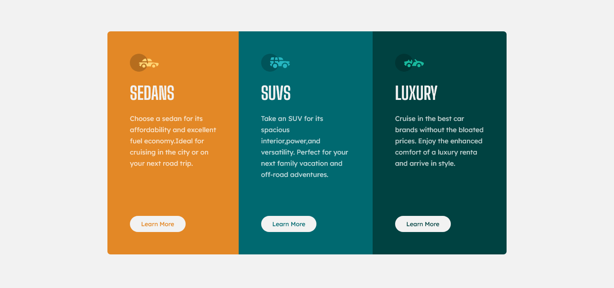

This is a solution to the 3 Column Preview Card

## Overview 

was a good challenge 

## The challenge  

adjusting the moblie view after finishing the desktop view
setting up the buttons border was a little hard since i didnt do it before
## Screenshot

##Live Site URL 

Website  https://alazarg19.github.io/Order-Summary-component/ 

##My process 

i started from the html and went on up from there everything was going smooth 

## Built with  

html and css 

flexbox 

  

##What i learned  
using the border width,border style and border color attribute
 

## Author 
Website  https://alazarg19.github.io/Order-Summary-component/Frontend Mentor @AlazarG19 

## Acknowledgments 